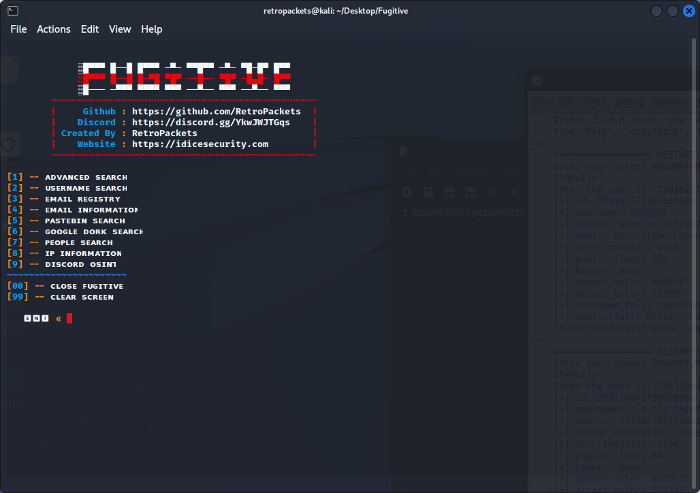

###ABOUT

[Fugitive was made to offer resourcfulness to 'Osint Investigations' Fugitive will allow you to collect detailed information about "subjects" and in further development will become one of the best OSINT tools for your personal or professional activities] 


## INSTALL
```
git clone https://github.com/RetroPackets/Fugitive
cd Fugitive
python3 fugitive.py
```


[The Developer Does not and will never be responsible for witch way users decide to use this resourceful tool]
